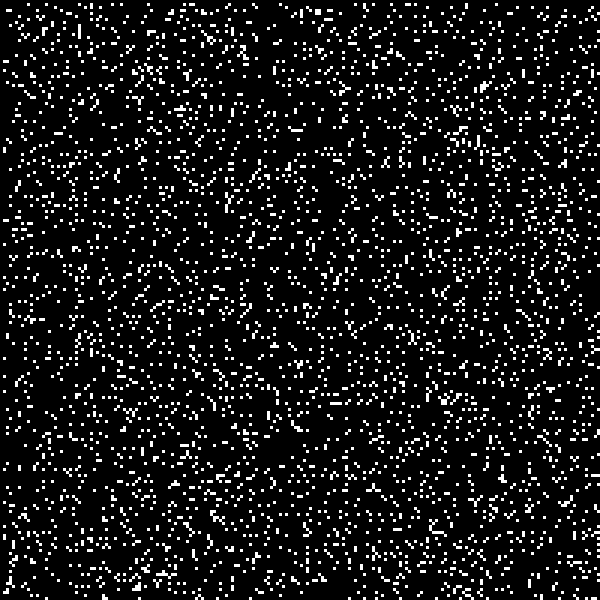

# Conway's Game of Life

Your task is to program [Conway's Game of Life](https://en.wikipedia.org/wiki/Conway%27s_Game_of_Life) using the C programming language.
To visualize the simulation, you have to generate a [PBM image](https://en.wikipedia.org/wiki/Netpbm#PBM_example) after every simulation step.
These images can then be combined into an animated gif using [ImageMagick](https://imagemagick.org/index.php).
ImageMagick can be used via the `convert` command-line program (see below).

A starting [template](template/) is provided, but you may start from scratch.

Your program does the following:

- Read in the following parameters from the command-line (see template)
  
  - Width of the game field (integer)
  
  - Height of the game field (integer)
  
  - Starting population density (float [0-1])
  
  - Number of simulation steps (integer)
    
    columns

- Seed the random number generator so we get a different starting population every time (see template)

- **Dynamically allocate** 2 game fields according to the given *width* and *height* (use `malloc`)
  
  - A game field is a big array of booleans where each element indicates whether the cell at this position (`x`, `y`) is alive or dead
  - For each simulation step one field will be the *source* while the other is the *destination*
  - Source and destination alternate every simulation step

- According to the given population density, mark cells in one field as alive (see `rand` standard library function)
  
  - A population density of 0.1 means that around 10% of all cells are marked alive
  - This field will be the source for the first simulation step

- Generate the first PBM image to record the starting population (use `fopen`, `fprintf`, `fclose`, …)
  
  - Each file should be named `gol_<step>.pbm` where `<step>` is the corresponding simulation step padded with zeros up to 5 digits.
    For example, the image for step 5 would be `gol_00005.pbm`.

- Run the simulation for the given number of steps
  
  - After every simulation step, generate a PBM file to record the result (see `snprintf` to generate the filename)

- Don't forget to clean up (use `free`)

- Your program must compile without warnings using the following flags:
  
  - `-std=c11 -Wall -Wextra`
  - Either compile your program with [AddressSanitizer](https://en.wikipedia.org/wiki/AddressSanitizer) enabled (`-fsanitize=address`) or run it via `valgrind` to check for errors

Here is how one would use the program (here named `game`) and then generate the animated gif.


```
$ ./game 200 200 0.1 10
width:    200
height:   200
density:   10%
steps:     10

$ ls *.pbm        # Here we see the generated PBM images, lets call ImageMagick next
gol_00000.pbm
gol_00001.pbm
gol_00002.pbm
gol_00003.pbm
gol_00004.pbm
gol_00005.pbm
gol_00006.pbm
gol_00007.pbm
gol_00008.pbm
gol_00009.pbm
gol_00010.pbm

$ convert -filter point -resize 300%x300% -delay 20 gol_*.pbm gol.gif
```


